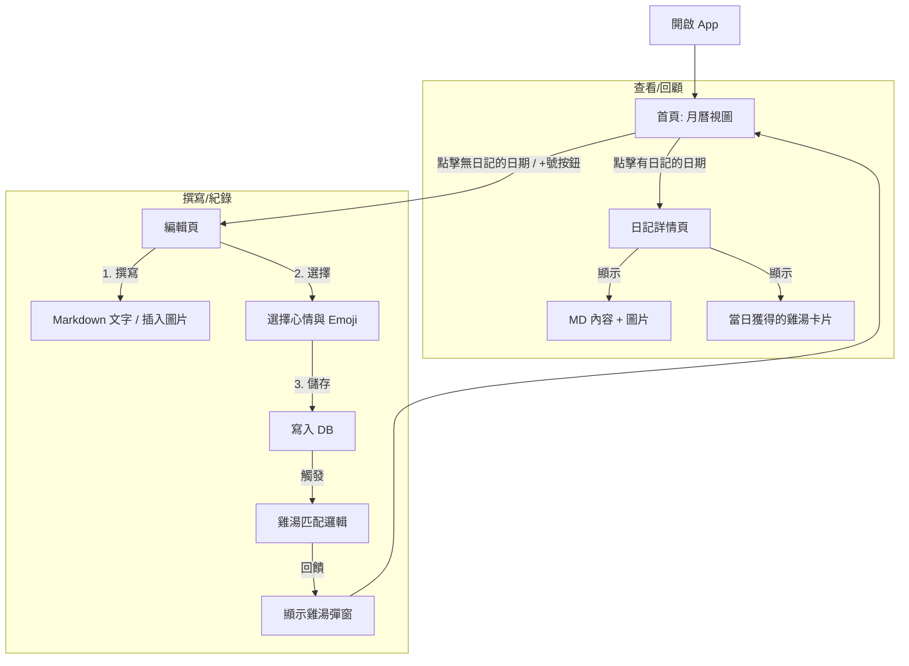

沒問題，撰寫一份清晰的 **規格書 (Specification, Spec)** 是開發成功的關鍵，特別是你希望「快速開發」時，Spec 能防止功能蔓延 (Feature Creep)。

這份 Spec 整合了你剛才確認的所有需求（日曆首頁、固定心情分類、本地雞湯庫、Isar 資料庫）。你可以將此文檔視為你的開發藍圖 (Blue Print)。

-----

# 專案規格書 (Project Specification)

**專案名稱 (暫定):** MoodDiary / 心情日記
**平台:** Android (Flutter)
**版本:** MVP (Minimum Viable Product)
**核心價值:** 本地優先 (Privacy-First)、情緒追蹤、即時雞湯回饋。

-----

## 1\. 使用者流程 (User Flow)



-----

## 2\. 功能需求 (Functional Requirements)

### 2.1 首頁 (Home / Calendar)

  * **預設視圖:** 顯示當前月份的日曆 (使用 `table_calendar`)。
  * **日期狀態顯示:**
      * **無日記:** 顯示日期數字。
      * **有日記:** 在日期下方顯示該日記選定的 **「具體 Emoji」** (如 😊, 🤬)。
      * **今日:** 特殊顏色標記。
  * **互動:**
      * 點擊空白日期 -\> 跳轉至 **編輯頁** (自動帶入該日期)。
      * 點擊已有日記日期 -\> 跳轉至 **詳情頁**。
  * **統計摘要 (Header):** (Optional for MVP) 簡單顯示本月「快樂天數」vs「悲傷天數」。

### 2.2 編輯頁 (Editor)

  * **日期顯示:** 顯示當前正在編輯的日期 (唯讀或可修改，MVP 建議唯讀，避免邏輯複雜)。
  * **內容輸入:**
      * 支援 Markdown 基本語法 (標題, 列表, 粗體)。
      * `TextField` 多行輸入。
  * **多媒體:**
      * 按鈕：插入圖片 (從相簿選取)。
      * 處理：將圖片複製到 App 本地目錄 (`ApplicationDocumentsDirectory`)，資料庫僅存路徑 `String`。
  * **心情選擇器 (Mood Selector):**
      * **UI:** 兩層式選單或展開式 UI。
      * **第一層 (分類):** 快樂、悲傷、生氣、愛情、中立。
      * **第二層 (具體 Emoji):** 點擊分類後，滑出對應的 Emoji 列表供選擇。
      * **驗證:** 必須選擇心情才能儲存。

### 2.3 詳情頁 (Detail)

  * **唯讀模式:** 渲染 Markdown (`flutter_markdown`)。
  * **雞湯展示區:** 顯示該篇日記當初獲得的雞湯語錄。
  * **操作:** 編輯 (跳轉回 Editor)、刪除 (跳出確認)。

### 2.4 雞湯推薦系統 (Recommendation Engine)

  * **觸發時機:** 使用者按下「儲存」按鈕後。
  * **邏輯:**
    1.  讀取使用者選的 `Mood Category` (例如: `Mood.sad`)。
    2.  讀取本地 `assets/quotes.json`。
    3.  篩選 `category == 'sad'` 的所有語錄。
    4.  隨機 `Random()` 選取一條。
    5.  (Optional) 若有網路且使用者開啟「AI 分析」，則非同步呼叫 LLM API 覆蓋此結果。

-----

## 3\. 資料結構 (Data Model & Schema)

### 3.1 心情定義 (Enum)

路徑: `lib/data/models/mood.dart`

| Enum Value | Label (TW) | Emojis (Specific) | Color Code (Hex) |
| :--- | :--- | :--- | :--- |
| `happy` | 快樂 | 😊, 😄, 😁 | `#FFA500` (Orange) |
| `sad` | 悲傷 | 😢, 😞, 😔 | `#607D8B` (BlueGrey) |
| `angry` | 生氣 | 😠, 😡, 🤬 | `#FF5252` (RedAccent) |
| `love` | 愛情 | ❤️, 😘, 😍 | `#FF4081` (PinkAccent) |
| `neutral` | 平靜/無感 | 😒, 😑, 😐 | `#9E9E9E` (Grey) |

### 3.2 日記實體 (Isar Collection)

路徑: `lib/data/models/diary_entry.dart`

```dart
@collection
class DiaryEntry {
  Id id = Isar.autoIncrement;

  @Index(unique: true) // 確保一天一篇，或使用複合索引
  late DateTime date;  // 日記所屬日期 (正規化為 00:00:00)

  late DateTime createdAt; // 實際寫入時間
  late DateTime updatedAt; 

  @Enumerated(EnumType.name)
  late Mood mood; // Enum: happy, sad...

  late String specificEmoji; // 儲存具體的 emoji 字元，如 "🤬"

  String? title; // (Optional)

  late String content; // Markdown raw text

  List<String>? images; // 本地圖片路徑列表

  // 儲存當下獲得的雞湯，避免未來 json 修改後回顧時變更
  String? cachedQuoteContent; 
}
```

### 3.3 雞湯資料庫 (JSON Asset)

路徑: `assets/data/quotes.json`

```json
[
  {
    "id": "1001",
    "content": "逃避雖可恥但有用，去睡覺吧。",
    "category": "sad",
    "author": "日劇台詞"
  },
  {
    "id": "2001",
    "content": "今天的快樂是奶茶給的！",
    "category": "happy",
    "author": "網友"
  }
]
```

-----

## 4\. 技術規格 (Technical Stack)

  * **Language:** Dart / Flutter (最新 Stable 版本)
  * **Architecture:** Feature-first or Layer-first (Clean Architecture 簡化版)
  * **State Management:** `flutter_riverpod`
  * **Database:** `isar`, `isar_flutter_libs`
  * **UI Components:**
      * Calendar: `table_calendar`
      * Charts: `fl_chart` (用於之後的心情趨勢)
      * Markdown: `flutter_markdown`
      * Image Picker: `image_picker`
  * **Utils:**
      * Date Formatting: `intl`
      * Path Provider: `path_provider` (存圖用)
      * UUID: `uuid` (若需要生成圖片檔名)

-----

## 5\. UI 設計準則 (Design Guidelines)

  * **色調:** 溫暖、療癒系。
      * 背景色建議使用 `Off-white` (\#FDFBF7) 或淺灰，避免純白太刺眼。
  * **字體:** 系統預設 Sans-serif，閱讀體驗優先。
  * **Emoji:** 直接使用系統原生 Emoji 字型 (Android/iOS 自動適配)，不需額外引入圖檔。

-----

## 6\. 開發階段 (Milestones)

1.  **Phase 1: Skeleton (1-2 天)**
      * 搭建專案，設定 Riverpod & Isar。
      * 完成 `Mood` Enum 定義與 `DiaryEntry` Schema。
      * 確認 `assets/quotes.json` 讀取正常。
2.  **Phase 2: Calendar & Editor (2-3 天)**
      * 實作首頁日曆，能顯示假資料的 Emoji。
      * 實作編輯頁，能存入文字並選擇心情。
      * 串接 DB，讓首頁能讀到真實資料。
3.  **Phase 3: Logic & Polish (1-2 天)**
      * 實作雞湯隨機推薦邏輯。
      * 實作圖片選擇與本地儲存。
      * UI 細節調整 (Padding, Colors)。

-----

這份 Spec 是否符合你目前的想像？如果沒問題，你可以將此存檔，我們就進入 Phase 1 的環境搭建與 Model 撰寫。